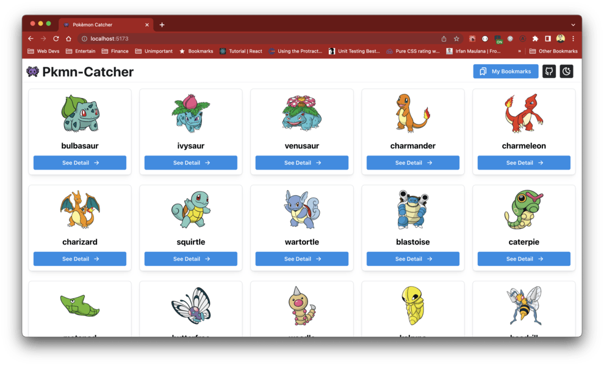
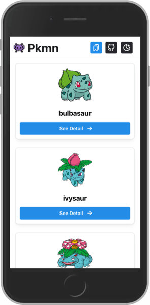

# 👾 pkmn-catcher

Just Another Pokèmon Catcher, based on PokeAPI v2

 

## Live

- [pkmn-catcher.surge.sh](https://pkmn-catcher.surge.sh)

## Screenshots

| Desktop                               | Mobile                              |
| ------------------------------------- | ----------------------------------- |
|  |  |

## Development

### Prerequisites

- Node.js (I recommend to use Node.js LTS `18.16.0`)
- PNPM v8 (You can use Yarn or NPM as well)

### Install Dependencies

`pnpm install`

### Run in Local

`pnpm run dev`

## Notable Libraries

- [React](https://react.dev/)
- [Vite](https://vitejs.dev/)
- [React Router 6](https://reactrouter.com/en/main)
- [Mantine](https://mantine.dev/)
- [SWR](https://swr.vercel.app/)
- [Tabler Icon](https://tabler-icons.io/)
- [LocalForage](https://github.com/localForage/localForage)
- [Vitest](https://vitest.dev/guide/)

## Read more

- [Create Vite Project for React](https://vitejs.dev/guide/)
- [Tutorial React Router 6](https://reactrouter.com/en/main/start/tutorial)
- [Install Mantine in Vite Project](https://mantine.dev/guides/vite/)
- [Getting Started with SWR](https://swr.vercel.app/docs/getting-started)
- [Adding a fallback in Surge.sh](https://surge.sh/help/adding-a-200-page-for-client-side-routing)
- [Setup Vitest, Testing Library, and msw](https://github.com/vitest-dev/vitest/tree/main/examples/react-testing-lib-msw)

---

© 2023, By @mazipan
